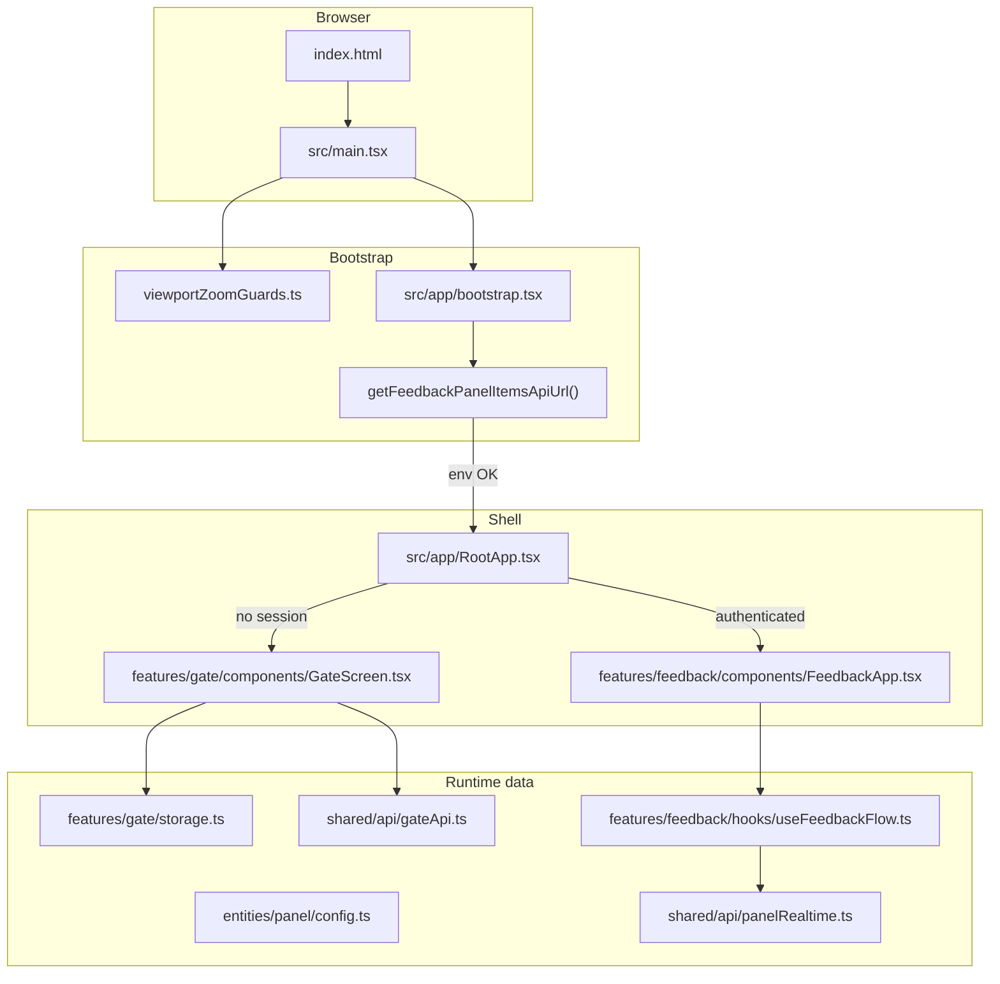

# Application flow (entry → gate → feedback)

This document walks through **what runs first**, **which files participate**, and **how data moves** through the toilet feedback PWA. Paths are relative to the repository root.

---

## Big picture

---

## Step 1 — Load the page

| Artifact | Role |
|----------|------|
| **`index.html`** | Declares `
`, viewport meta, loads the Vite bundle. Nothing React-specific runs until JS loads. |
| **`src/main.tsx`** | Application entry: installs zoom guards, imports global CSS, calls **`bootstrap()`**. |

---

## Step 2 — Zoom guards (optional UX policy)

| File | Role |
|------|------|
| **`src/viewportZoomGuards.ts`** | Registers listeners that discourage Ctrl+wheel zoom and WebKit gesture zoom. Viewport meta in `index.html` is still the primary “no pinch zoom” control. |

---

## Step 3 — Bootstrap React

| File | Role |
|------|------|
| **`src/app/bootstrap.tsx`** | (1) Ensures `#app` exists. (2) Calls **`getFeedbackPanelItemsApiUrl()`** from **`src/entities/panel/config.ts`** — if required env vars are missing, renders a friendly error instead of the app. (3) **`createRoot(...).render(<RootApp />)`**. (4) In production, registers the **service worker** (`virtual:pwa-register`) for PWA offline/update behavior. |
| **`src/shared/styles/index.css`** | Imports base, orientation, feedback, gate styles (loaded by `main.tsx`). |

**Env check:** `VITE_PANEL_STREAM_BASE_URL` and `VITE_FEEDBACK_PANEL_ITEMS_PATH` must be set so the app can build the URL for **`getFeedbackPanelItems`** (gate + panel definition). See **`src/entities/panel/config.ts`**.

---

## Step 4 — Root shell: config, gate, or panel

| File | Role |
|------|------|
| **`src/app/RootApp.tsx`** | Owns three phases: **loading base config**, **gate (login)**, **authenticated feedback UI**. Uses **`useLandscapeGuard`** from **`src/features/orientation/orientation.tsx`** (landscape enforcement). |

### 4a — Load initial panel config

1. **`loadPanelConfig()`** (`entities/panel/config.ts`) merges **defaults** (thank-you timer, timezone, optional realtime base URL) with empty API patch and attaches **`feedbackPanelItemsApiUrl`** from env.
2. Result is stored as **`initialConfig`**.

### 4b — Restore session (optional)

1. **`getStoredGateSetup()`** (`features/gate/storage.ts`) reads **`localStorage`** for a saved location code + password (versioned JSON).
2. If present, **`authenticateGateWithBackend`** (`shared/api/gateApi.ts`) **POST**s to **`feedbackPanelItemsApiUrl`** with `location_code` and `password`.
3. On success, **`mapPanelResponseToConfigPatch`** (`shared/api/panelMappers.ts`) turns API JSON into a **`Partial<PanelConfig>`**, then **`loadPanelConfig(patch)`** merges it.
4. **`buildRuntimeConfig`** (in `RootApp.tsx`) adds **SSE + snapshot URLs** via **`buildPanelRealtimeUrls`** (`shared/api/endpoints.ts`):  
   `{realtimeBase}/api/feedback/panels/{panelId}/stream` and `.../latest-metrics`.
5. **`setRuntimeState({ config, locationCode })`** → user skips the gate UI.

### 4c — Gate screen (no valid session)

| File | Role |
|------|------|
| **`src/features/gate/components/GateScreen.tsx`** | Form: location code + password → **`onSubmit`** → **`onGateSubmit`** in `RootApp`. |
| **`authenticateGateWithBackend`** | Same POST as above; on success **`saveGateSetup`** persists credentials and **`buildRuntimeConfig`** runs. |

### 4d — Errors

- **`bootError`**: uncaught failure during initial load → plain error UI.
- **`gateError`**: invalid credentials message on **`GateScreen`**.

---

## Step 5 — Feedback UI (three tiers)

| File | Role |
|------|------|
| **`src/features/feedback/components/FeedbackApp.tsx`** | Thin shell: picks **Tier1 / Tier2 / Tier3** screens based on **`model.screen`**, passes **`config`** and **`locationCode`** into **`useFeedbackFlow`**. |
| **`src/features/feedback/hooks/useFeedbackFlow.ts`** | **Orchestrates everything below.** |

### State inside `useFeedbackFlow`

| Concern | Implementation |
|---------|------------------|
| **Which tier** | **`feedbackReducer`** in **`src/features/feedback/model/reducer.ts`** (`tier1` → `tier2` / `tier3` depending on rating path; `tier3` auto-dismiss after **`thankYouResetMs`**). |
| **Live metrics** | **`createPanelRealtimeProvider`** in **`src/shared/api/panelRealtime.ts`** subscribes to **SSE** (`panelStreamUrl`) with **HTTP fallback** (`panelLatestMetricsUrl`). Updates **`snapshot`** (`shared/types/panelState.ts`: footfall, temperature, humidity, `updatedAt`). |
| **Tier 1 buttons** | **`buildTier1RatingRows`** (`entities/panel/feedbackAssets.ts`) from **`config.feedbackRatings`**. |
| **Tier 2 tiles** | **`buildTier2Items`** (`entities/panel/feedbackAssets.ts`) from **`config.feedbackItems`** + **`VITE_AWS_RESOURCE_BASE_URL`** for image paths. |
| **Submitting feedback** | **`submitPositiveRatingFeedback` / `submitNegativeRatingFeedback`** (`shared/api/feedbackApi.ts`) → backend **`getFeedback`** style endpoints derived from panel items URL (**`buildFeedbackEndpoints`** / **`buildTier2SubmitUrl`** in **`shared/api/endpoints.ts`**). |
| **Logout** | **`clearGateSetup`** (`gate/storage.ts`) + **`window.location.reload()`**. |

### Screens

| Component | File | Responsibility |
|-----------|------|----------------|
| Tier 1 | **`features/feedback/components/Tier1Screen.tsx`** | Metrics + ratings + QR; calls **`onPickRating`**. |
| Tier 2 | **`features/feedback/components/Tier2Screen.tsx`** | Category grid + submit + optional **Back** to tier 1 when ratings are enabled. |
| Tier 3 | **`features/feedback/components/Tier3Screen.tsx`** | Thank you; timer or dismiss resets flow via reducer. |

---

## Data flow summary

1. **Env** → **`feedbackPanelItemsApiUrl`** + AWS base URL for images.  
2. **Gate POST** → **`FeedbackPanelApiResponse`** → **mapper** → **`PanelConfig`** (+ realtime URLs).  
3. **`PanelConfig` + `locationCode`** → **`useFeedbackFlow`** → reducer + realtime + API submits.  
4. **UI** reads **`model`**, **`snapshot`**, **`tier1Ratings`**, **`tier2Items`** and invokes callbacks that mutate reducer or call APIs.

---

## Related docs

- **[Realtime / sensor workflow](./realtime-sensor-workflow.md)** — how SSE and snapshot URLs relate to metrics on Tier 1.
- **README** — scripts, deploy, Android kiosk notes.

---

## Legacy note

**`src/app.tsx`** (repository root under `src/`) is an older, self-contained variant of the feedback UI and is **not** mounted by **`main.tsx`**. The live tree is **`src/app/bootstrap.tsx`** → **`RootApp`** → **`features/**`.
